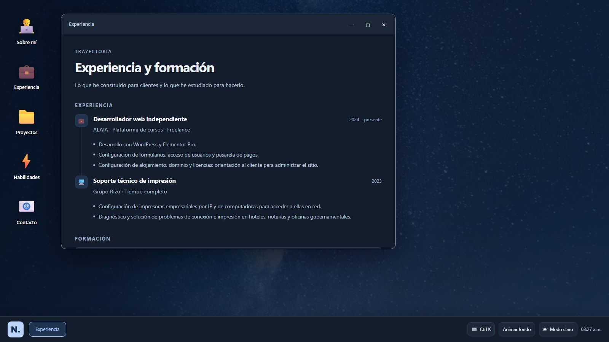
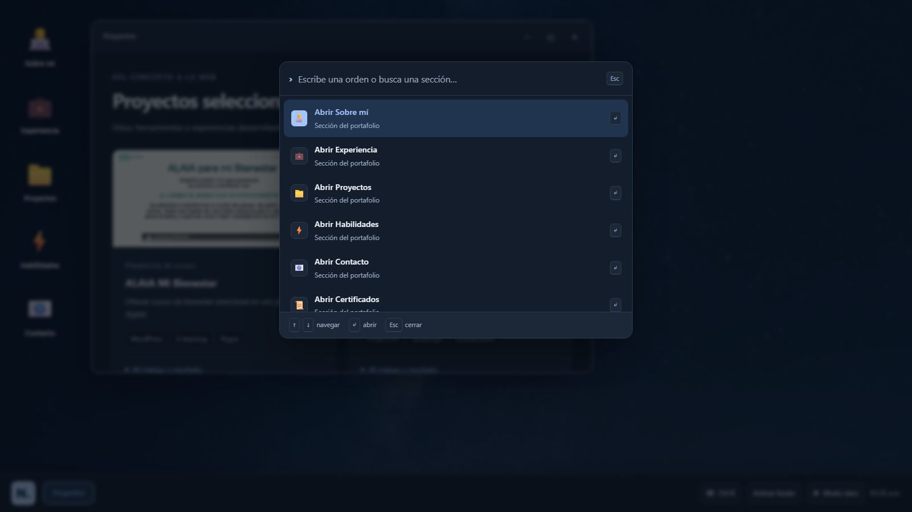
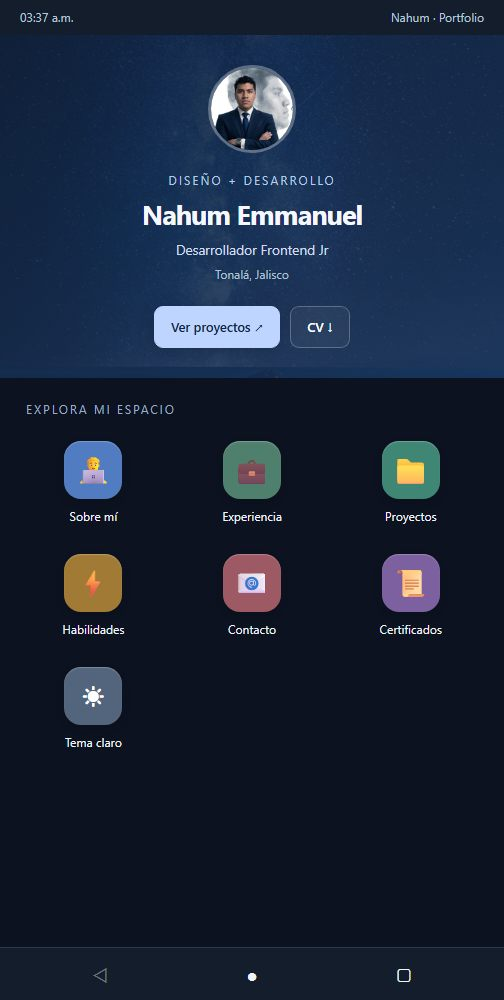

# Portafolio de Nahum Emmanuel Gutiérrez González

[](https://react.dev)
[](https://vite.dev)
[](https://vitest.dev)
[](https://eslint.org)
[](https://portafolio-nahum.netlify.app)

Portafolio personal con escritorio inspirado en Windows y navegación móvil inspirada en Android. Incluye seis proyectos desarrollados íntegramente por Nahum, experiencia profesional, formación, habilidades, certificados y CV.



## Índice

- [Demo](#demo)
- [Características](#características)
- [Atajos de teclado](#atajos-de-teclado)
- [Desarrollo local](#desarrollo-local)
- [Scripts](#scripts)
- [Stack](#stack)
- [Contenido editable](#contenido-editable)
- [CV y datos abiertos](#cv-y-datos-abiertos)
- [SEO](#seo)
- [Verificación](#verificación)
- [Estructura](#estructura)
- [Publicación](#publicación)

## Demo

Sitio: https://portafolio-nahum.netlify.app
Fuente: https://github.com/nahum29/Portafolio-Nahum

## Características

- Bienvenida con acceso al escritorio, proyectos y descarga del CV.
- Ventanas que se pueden mover desde su barra de título, minimizar, restaurar, maximizar y cerrar.
- Doble clic en la barra de título para maximizar o restaurar.
- Botón N. para mostrar el escritorio; la barra de tareas permite recuperar las ventanas.
- Límites ajustados al tamaño de pantalla para mantener los controles por encima de la barra de tareas.
- Ventana **Experiencia** con la trayectoria profesional y la formación, en una línea de tiempo.
- Paleta de comandos (estilo Spotlight o VS Code) para abrir secciones, descargar el CV, cambiar el tema o copiar el correo.
- Versión móvil hasta 768 px, con los mismos contenidos y navegación de inicio y regreso.
- Tema claro y oscuro con preferencia guardada cuando el almacenamiento está disponible.
- Fondo estático por defecto. El video de aproximadamente 6,2 MB se carga solo al elegir «Animar fondo».
- La preferencia del sistema de reducir movimiento deshabilita el video y las animaciones CSS.
- Enlace «Saltar al contenido», botones accesibles por teclado, foco visible, `Escape` para cerrar la ventana activa y controles de ventana con nombres descriptivos.




## Atajos de teclado

| Atajo | Acción |
| --- | --- |
| `Ctrl` + `K` o `Cmd` + `K` | Abrir o cerrar la paleta de comandos |
| `↑` `↓` | Moverse por los comandos |
| `Enter` | Ejecutar el comando seleccionado |
| `Escape` | Cerrar la paleta o la ventana activa |
| `Tab` | Recorrer la interfaz; el primer destino es el enlace «Saltar al contenido» |

La paleta es un diálogo modal: el foco no escapa de ella mientras está abierta y vuelve al contenido principal al cerrarla.

## Desarrollo local

Requiere Node.js compatible con las dependencias del archivo de bloqueo. El despliegue usa Node.js 20.11 (fijado en `netlify.toml`); para desarrollo y pruebas sirve Node.js 20 o 22.12 y superior.

```sh
npm ci
npm run dev
```

Abre la dirección que indique Vite (normalmente http://localhost:5173).

## Scripts

- `npm run dev`: servidor local.
- `npm run build`: compilación de producción en `dist/`.
- `npm run preview`: vista previa de esa compilación. Si el puerto está ocupado, pásalo directamente: `npx vite preview --port 4173 --strictPort`.
- `npm run lint`: análisis estático con ESLint.
- `npm run test:run`: pruebas automatizadas con Vitest y Testing Library.
- `npm test`: pruebas en modo observación.

## Stack

React 19, Vite 5 y CSS. Las versiones exactas reproducibles están en `package-lock.json`.

## Contenido editable

Los proyectos, habilidades, certificados, contactos, experiencia y formación se editan en `src/data/portfolio.js`.
Ambas interfaces renderizan `WindowContent.jsx`; no mantienen listas separadas.

Las cinco capturas se guardan en `public/images/projects/` en formato JPEG, con sus dimensiones reales declaradas en `src/data/portfolio.js` para reservar el espacio antes de cargarlas. Se obtuvieron de sus sitios públicos el 29 de septiembre de 2026. Su tamaño total es inferior a 300 KB y se cargan de forma diferida.

Tiendita C.P.S no tiene sitio desplegado, así que su tarjeta usa la portada de texto del proyecto y enlaza su repositorio en lugar de una captura.

El proyecto de Funeraria Hermosa Provincia se retiró del portafolio en octubre de 2026 porque su dominio venció y el sitio dejó de estar en línea.

Las descripciones reflejan las funcionalidades del portafolio original y la autoría confirmada por Nahum. No se afirman mejoras de ventas, tráfico o rendimiento sin medición.

## CV y datos abiertos

- `public/cv/CV-Nahum-Gutierrez.pdf`: currículum en PDF de una página.
- `public/resume.json`: el mismo currículum en el estándar [JSON Resume](https://jsonresume.org/), pensado para los sistemas de reclutamiento. `index.html` lo declara con un `<link rel="alternate">` y `sitemap.xml` lo incluye.
- `src/test/resume.test.js` comprueba que `resume.json` y `src/data/portfolio.js` dicen lo mismo: proyectos, enlaces, habilidades, certificados, experiencia y formación. Si cambias uno, la prueba falla hasta que actualices el otro.

No todos los proyectos tienen su código fuente publicado. Solo Tiendita C.P.S y este portafolio tienen repositorio público, y ambos están comprobados con la API de GitHub; en `src/data/portfolio.js` → `codeLinks` y en el campo `repo` de cada proyecto no aparece ningún enlace que no responda.

## SEO

`public/robots.txt` permite el rastreo y apunta al sitemap; `public/sitemap.xml` lista la raíz, el CV y `resume.json`.
`index.html` incluye meta tags de descripción, Open Graph, Twitter Card y datos estructurados JSON-LD del perfil (`schema.org/Person` con `sameAs` y `knowsAbout`).

## Verificación

La suite incluye 16 pruebas con regresiones para restaurar ventanas minimizadas, gestionar la ventana activa al cerrar, maximizar/restaurar, abrir secciones con teclado, cerrar con `Escape`, abrir y filtrar la paleta de comandos, cargar el video bajo demanda, acceder a los seis proyectos en móvil y mantener `resume.json` sincronizado con el portafolio.

### Lighthouse

Medición con Lighthouse 12.8.2 sobre `dist/` servido en local (móvil, simulated throttling), el 8 de octubre de 2026:

| Categoría | Puntuación |
| --- | --- |
| Rendimiento | 99 |
| Accesibilidad | 100 |
| Buenas prácticas | 100 |
| SEO | 100 |

Métricas: FCP 1,3 s · LCP 2,1 s · TBT 80 ms · CLS 0 · TTI 2,1 s · peso total 192 KB.

La primera corrida previa a los ajustes arrojó 41,9 % de texto legible, 37 KiB de imagen sobredimensionada y `framer-motion` en el bundle sin animaciones que lo usaran. Los cambios fueron: tipografías mínimas de 12 px, un avatar de 240 px en lugar de 640 px, fondo recompresado de 208 KB a 108 KB, eliminación de `framer-motion` y precarga del fondo del encabezado.

Estas cifras son de una compilación local, no del sitio desplegado, y varían entre corridas según la carga de la máquina. Deben volver a medirse sobre https://portafolio-nahum.netlify.app antes de citarlas.

## Estructura

```text
src/
  components/    Interfaces de bienvenida, escritorio, móvil, paleta y contenido compartido
  context/       Preferencia de tema
  data/          Contenido del portafolio
  test/          Pruebas y configuración
public/
  images/        Fotografía, fondo y capturas de proyectos
  certificados/  Certificados PDF
  cv/            Currículum
  resume.json    Currículum en JSON Resume
  video/         Fondo animado opcional
  robots.txt     Reglas de rastreo
  sitemap.xml    Mapa del sitio
  favicon.svg    Identidad visual del portafolio
docs/            Capturas usadas en este README
```

## Publicación

`netlify.toml` contiene la configuración de Netlify. Genera `dist/` con `npm run build` antes de publicar. Los cambios locales no actualizan el sitio público hasta que se despliegan.

Sitio: https://portafolio-nahum.netlify.app
GitHub: https://github.com/nahum29
